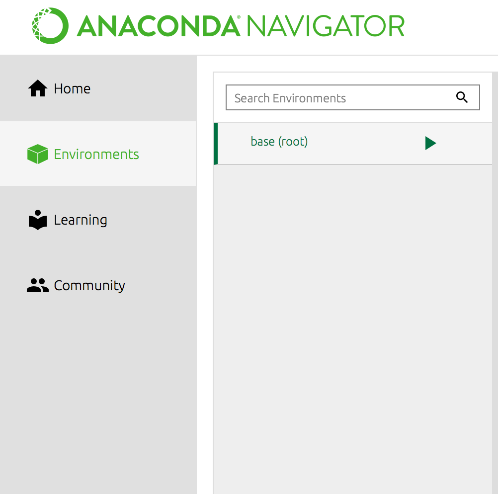
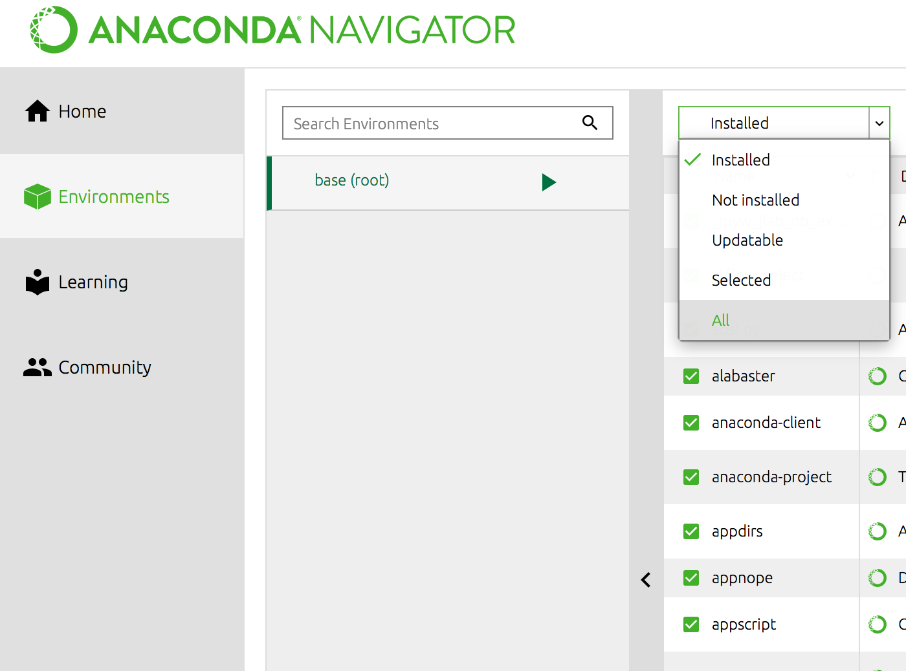
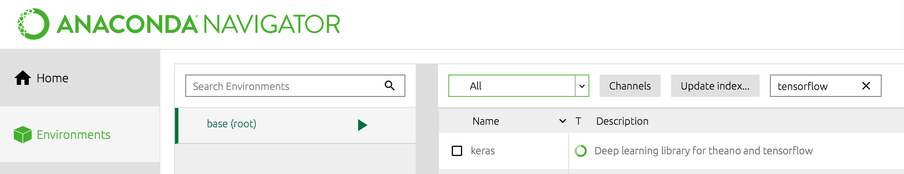

# GDG_for_ML_Newcastle

## Instructions 

1. Install Anaconda

   Download Anaconda [here](https://www.anaconda.com/) and install.

2. Install Keras (Tensorflow)

   In anaconda, go to '**Enviroments**', create a new enviroment or select the '**base(root)**' enviroment. 
   

   
   

   
   Click the droplist on the top left and change it from '**Installed**' to '**All**'. 
   

   
   

   
   Seach the **tensorflow** and tick the box before it, apply.
   

   
   

3. Launch the Jupyter Notebook 

   Go to '**Home**' in anaconda,  launch the Jupyter Notebook. 
   
   Download the notebook(*.ipynb) in this repository and run it.

